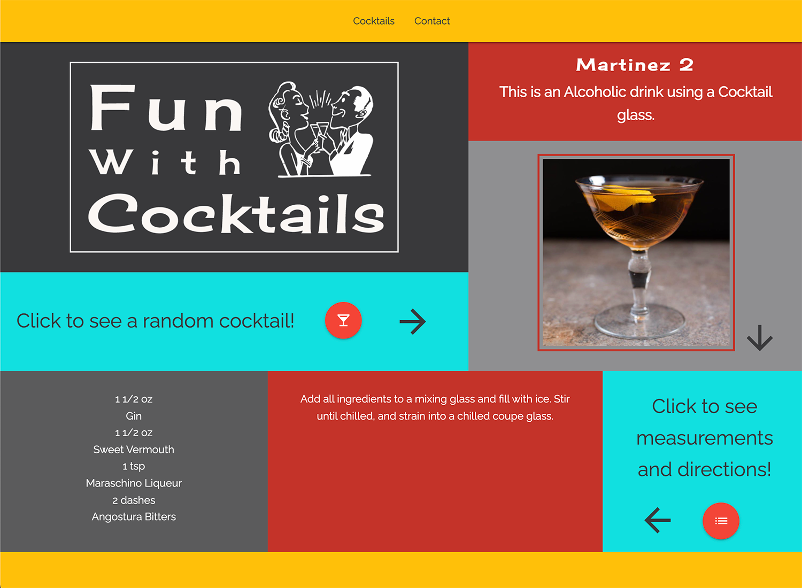

# Fun With Cocktails

## Project Description

[Fun With Cocktails](https://jennifer0101.github.io/Fun-With-Cocktails/) is an app that allows the user to select random cocktails and see the ingredients and instructions for making it.

## Technologies 

* JQuery
* Javascript
* CSS3
* HTML5
* Materialize
* TheCocktailDB API
* It's Tuesday CSS Animation Library

## Screenshots

## Features
List of features ready and TODOs for future development
* Generates a random cocktail from TheCokctailDB when a button is clicked.
* Generates both a list of ingredients and directions when another button is clicked.
* Uses It's Tuesday animation library to create fade in of elements.

To-do list:
* Display the list of ingredients with the quantity displayed inline, not above and below.  

## Status
Project is: _in progress_.

## Contact
Created by [@jennifer0101](https://www.fayecreative.com) - feel free to contact me!